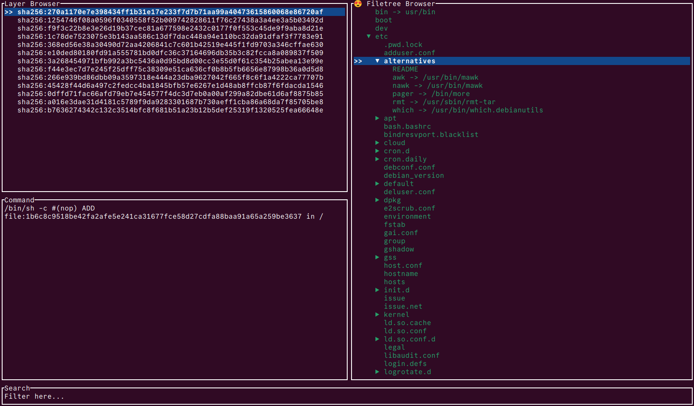

# FreightView

FreightView is a Terminal User Interface (TUI) application for viewing content of local docker images. It provides a simple and efficient way to explore the layers and files within your Docker images. It is inspired by the [dive](https://github.com/wagoodman/dive) application. 

## Why use FreightView?
🔥  FreightView is fast and efficient. It caches layers that have been already viewed so there are no unnecessary parcing, especially for common large base images for containers you use.

🚀  It is written in Rust, which means it is fast, has a small footprint and is memory-safe.

🖥️  It is a TUI application, which means it can be run in a terminal and does not require a graphical user interface. This makes it lightweight and easy to use on remote servers or in environments where a GUI is not available.

## License

This project is licensed under the MIT License - see the [LICENSE](LICENSE) file for details.

## More
* Extremely fast startup time, even for large images, if the layers have been already viewed.

* View the list of layers, commands that were used to create them, and their content in a file tree view.

